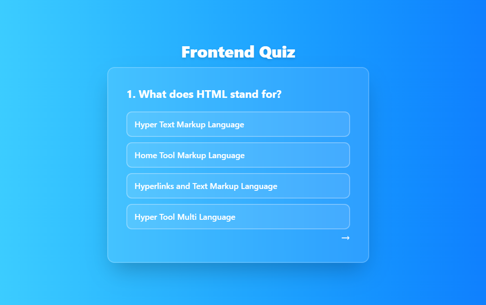

# Frontend Quiz App

A simple interactive Frontend Quiz App built with HTML, JavaScript, and Tailwind CSS.

## Purpose of the Project

This project was created as a practice and revision tool for a frontend student I teach.

The goal was to build an interactive quiz application covering core HTML and CSS concepts that we have studied so far, including Flexbox, Grid, semantic HTML, styling, transforms, display properties, and more.

While the quiz covers many important topics, it represents only part of the broader frontend material we have worked on together.

## Features

- 50+ HTML & CSS questions
- Dynamic question rendering with JavaScript
- Correct answers highlighted in green
- Incorrect answers highlighted in red
- Next question navigation
- Responsive modern UI
- Glassmorphism design using Tailwind CSS

---

## Technologies Used

- HTML5
- JavaScript (Vanilla JS)
- Tailwind CSS

---

## Project Structure

```bash
Quiz-app/
│
├── index.html
├── script.js
├── styles/
│   └── input.css
│   └── output.css
└── README.md
```

---

## How It Works

Questions are stored inside a JavaScript array:

```js
{
  question: "What does HTML stand for?",
  answers: [
    "Hyper Text Markup Language",
    "Home Tool Markup Language",
    "Hyperlinks and Text Markup Language",
    "Hyper Tool Multi Language"
  ],
  correct: 0
}
```

The app dynamically:

- renders questions
- creates answer elements
- checks selected answers
- highlights correct and incorrect options
- loads the next question

---

## Learning Goals

This project practices:

- Arrays & Objects
- DOM Manipulation
- Event Listeners
- Functions
- Loops
- Conditional Logic
- Dynamic Rendering
- Tailwind Styling

---

## Future Improvements

Possible future features:

- Score counter
- Timer
- Progress bar
- Randomized questions
- Difficulty levels
- Local storage for scores
- Mobile optimization

---

## Screenshot



---

## Live Demo

```
https://lanssii.github.io/frontend-quiz-app/

```

---

## Author

Made by Lana Shotashvili
